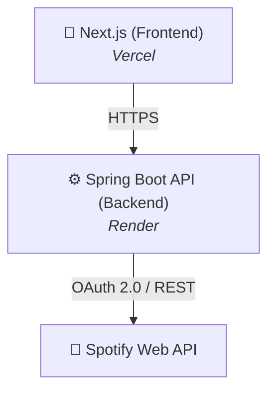

# 🎵 EchoTrace - Spotify Stats

> Aplicación Full Stack para consultar, analizar y visualizar estadísticas personales de Spotify, construida con Java/Spring Boot y Next.js y desplegada mediante una arquitectura desacoplada.

[](https://sonarcloud.io/summary/new_code?id=rws-EchoTrace)
[](https://sonarcloud.io/summary/new_code?id=rws-EchoTrace)
[](LICENSE)
[](https://www.java.com/)
[](https://spring.io/projects/spring-boot)
[](https://github.com/deevidpb/EchoTrace/actions/workflows/backend.yml)

🌐 **Demo en vivo:** [https://echo-trace-eta.vercel.app/](https://echo-trace-eta.vercel.app)

---

## 📸 Screenshots

---

## ✨ Features

* 🔐 Autenticación mediante **OAuth 2.0 con Spotify**.
* 📊 Consulta y visualización de estadísticas personales de Spotify.
* 📱 Interfaz **responsive** desarrollada con React y Next.js.
* ⚙️ Configuración mediante **variables de entorno**.
* 🧪 Tests automatizados para el backend.
* 🔄 Integración y validación automatizada mediante **GitHub Actions**.
* 🚀 Despliegue independiente del frontend y backend mediante **Vercel y Render**.

---

## 🏗️ Architecture



EchoTrace utiliza una arquitectura desacoplada en la que el frontend y el backend se despliegan y gestionan de forma independiente.

* Frontend: aplicación React/Next.js desplegada en Vercel.
* Backend: API REST desarrollada con Spring Boot y desplegada en Render.
* Autenticación: OAuth 2.0 mediante Spotify.
* Comunicación: peticiones HTTPS entre frontend, backend y Spotify Web API.

---

## 🛠️ Tech Stack

### Backend
* Java 21
* Spring Boot 4
* Spring Security 7
* Maven

### Frontend
* TypeScript
* React
* Next.js

### Testing & Quality
* JUnit 5
* Mockito
* JaCoCo
* SonarCloud

### DevOps & Security
* GitHub Actions
* GitHub Dependabot
* CodeQL
* Dependency Review
* Docker
* Docker Compose

### Deployment
* Vercel — Frontend
* Render — Backend API

---

## 🔐 Security

EchoTrace incorpora diferentes mecanismos para proteger la autenticación, las comunicaciones y la configuración de la aplicación.

* 🔑 Autenticación mediante **OAuth 2.0 con Spotify**.
* 🍪 Gestión de sesión mediante cookies `HttpOnly`, `Secure` y `SameSite=None`.
* 🛡️ Protección contra ataques **CSRF**.
* 🌐 Configuración de **CORS** restringida a los orígenes autorizados.
* 🔒 Credenciales y configuración sensible gestionadas mediante **variables de entorno**.
* 🚫 Secretos y credenciales excluidos del repositorio.
* 🔎 Análisis automatizado de código mediante **CodeQL**.
* 📦 Análisis de vulnerabilidades en dependencias mediante **Dependency Review**.
* 🤖 Actualización automatizada de dependencias mediante **Dependabot**.
* 🛡️ Protección de la rama principal mediante **GitHub Rulesets**.
---

## 🧪 Testing

El backend cuenta con una suite de pruebas automatizadas desarrollada con **JUnit 5** y **Mockito**.

Las pruebas se ejecutan automáticamente mediante GitHub Actions como parte del proceso de integración continua.

Para ejecutar las pruebas localmente:

```bash
./mvnw verify
```

---

## 📊 Code Quality

EchoTrace utiliza **SonarCloud** y **JaCoCo** para monitorizar la calidad y cobertura del código.

* 📈 **Cobertura de código superior al 90 %**.
* ✅ **Quality Gate** aprobado mediante SonarCloud.
* 🐛 Análisis automatizado de bugs.
* 🧹 Detección de code smells.
* 🔍 Análisis estático del código.
* 📊 Generación de métricas de cobertura mediante JaCoCo.

El análisis de calidad se ejecuta automáticamente mediante GitHub Actions y debe cumplir los criterios definidos en el Quality Gate antes de integrar los cambios.

---

## 🔄 CI/CD

EchoTrace utiliza **GitHub Actions** para automatizar la integración y validación de los cambios.

Los cambios enviados mediante Pull Requests hacia `main` son validados automáticamente mediante diferentes workflows:
* 🧪 Ejecución de tests del backend.
* 🏗️ Compilación y validación del proyecto.
* 🎨 Validación y build del frontend.
* 🐳 Construcción de imágenes Docker.
* 📊 Análisis de calidad mediante SonarCloud.
* 🔒 Análisis de seguridad mediante CodeQL.
* 📦 Dependency Review para detectar dependencias vulnerables.
* 🤖 Actualización automatizada de dependencias mediante Dependabot.

Los workflows forman parte de las comprobaciones requeridas por los **GitHub Rulesets**, evitando integrar cambios que no superen las validaciones definidas.

### Pull Requests

Los cambios se integran mediante **Pull Requests** y la rama `main` está protegida mediante **GitHub Rulesets**.

Los checks requeridos deben finalizar correctamente antes de permitir la integración de cambios en la rama principal.

---

## ☁️ Deployment

EchoTrace está desplegado utilizando una arquitectura independiente para frontend y backend.

| Componente | Plataforma |
|---|---|
| Frontend | Vercel |
| Backend API | Render |
| CI/CD | GitHub Actions |
| Code Quality | SonarCloud |

El frontend y el backend se despliegan de forma independiente y utilizan variables de entorno para adaptar la configuración al entorno de ejecución.

La aplicación está disponible en producción:

🌐 **[EchoTrace](https://echo-trace-eta.vercel.app/)**

---

## ⚙️ Local Development

### Prerrequisitos
* **Java 21** o superior
* **Node.js 22** y **npm**
* **Docker**

### Configuración de Spotify Developer

Para poder utilizar la aplicación es necesario crear una aplicación en el **Spotify Developer Dashboard** y configurar las credenciales de acceso mediante OAuth 2.0.

1. Accede al [Spotify Developer Dashboard](https://developer.spotify.com/dashboard).
2. Inicia sesión con tu cuenta de Spotify.
3. Selecciona **Create app**.
4. Introduce un nombre y una descripción para la aplicación.
5. En **Redirect URI**, añade la URL de callback que utiliza este proyecto. (http://127.0.0.1:8080/login/oauth2/code/spotify)
6. Selecciona los productos/scopes necesarios para la aplicación.
   - user-read-email
   - user-read-private
   - user-top-read
   - user-library-read
   - user-read-recently-played
   - user-read-playback-state
   - user-read-currently-playing
   - user-modify-playback-state
   - playlist-read-private
   - user-follow-read
7. Acepta los términos y condiciones de Spotify.
8. Pulsa **Save**.

Una vez creada la aplicación, Spotify proporcionará las siguientes credenciales:

* **Client ID**
* **Client Secret**

> ⚠️ **Importante:** el `Client Secret` es una credencial privada y no debe publicarse ni incluirse directamente en el código fuente.


### Variables de entorno
Crea un archivo `.env` en la raíz del proyecto  con la siguiente estructura:
```env
FRONTEND_URL=http://127.0.0.1:3000
NEXT_PUBLIC_API_URL=http://127.0.0.1:8080
CLIENT_ID=your_spotify_client_id
CLIENT_SECRET=your_spotify_client_secret
SPRING_PROFILES_ACTIVE=local
```

> ⚠️ No subas el archivo `.env` al repositorio. Contiene credenciales sensibles.

### Ejecutar con Docker
```bash
docker compose up --build
```
Una vez iniciados los contenedores, la aplicación estará disponible en:

* Frontend: `http://127.0.0.1:3000`
* Backend: `http://127.0.0.1:8080`

---

## 📁 Project Structure

```text
EchoTrace/
├── .github/
│   ├── workflows/       # Workflows de CI/CD, seguridad y calidad
│   └── dependabot.yml   # Actualización automática de dependencias
├── rws/                 # Backend Spring Boot
├── spa/                 # Frontend Next.js
├── docker-compose.yml
├── LICENSE
├── qodana.yaml
└── README.md
```

---

## 📌 Project Status

🟢 **Production — Active**

EchoTrace se encuentra actualmente desplegado y operativo en producción.

El proyecto cuenta con:

* ✅ Frontend desplegado en Vercel.
* ✅ Backend desplegado en Render.
* ✅ Autenticación OAuth 2.0 con Spotify.
* ✅ CI/CD mediante GitHub Actions.
* ✅ Tests automatizados.
* ✅ Quality Gate mediante SonarCloud.
* ✅ Análisis de seguridad y dependencias.
* ✅ Protección de la rama principal mediante GitHub Rulesets.
* ✅ Actualización automatizada de dependencias mediante Dependabot.

Los cambios continúan siendo validados automáticamente mediante el pipeline de CI/CD antes de integrarse en `main`.

---

## 📝 License

Este proyecto está publicado bajo la **PolyForm Noncommercial License**.

Puedes utilizar, estudiar, modificar y distribuir este código siempre que dicho uso sea **no comercial**.

No está permitido utilizar este proyecto, ni partes sustanciales del mismo, con fines comerciales o para obtener un beneficio económico sin autorización previa del autor.

Para más información, consulta el archivo [`LICENSE`](LICENSE) incluido en este repositorio.

